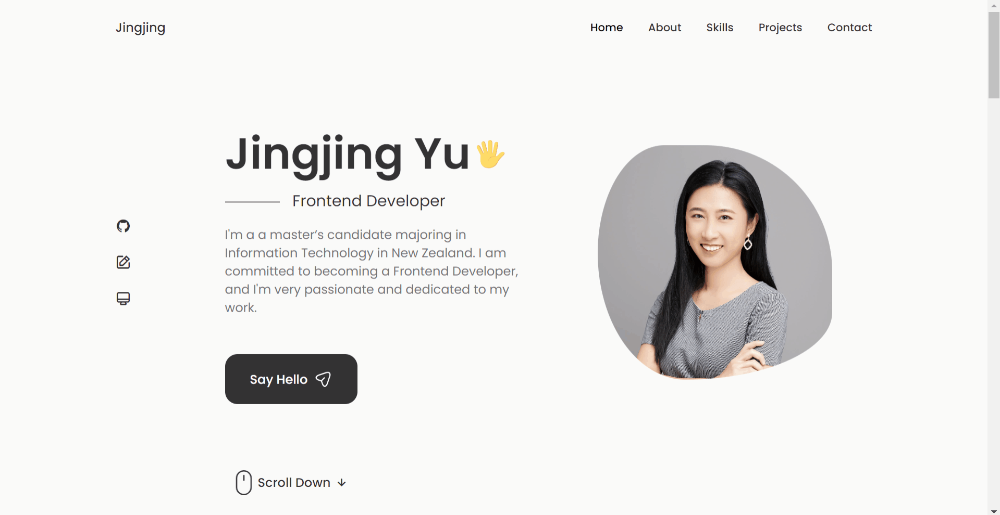

# Portfolio Website

## 1. Introduction

This is a personal portfolio website developed to showcase my skills and experience as a React developer. The website includes various sections that introduce myself, display my projects, and allow visitors to contact me. The frontend is built using React, adapted to various screen sizes through responsive design, and it integrates the EmailJS SDK to collect contact information.

## 2. Deploy

on Vercel: https://portfolio-self-three-40.vercel.app/

## 3. Demo Pictures

